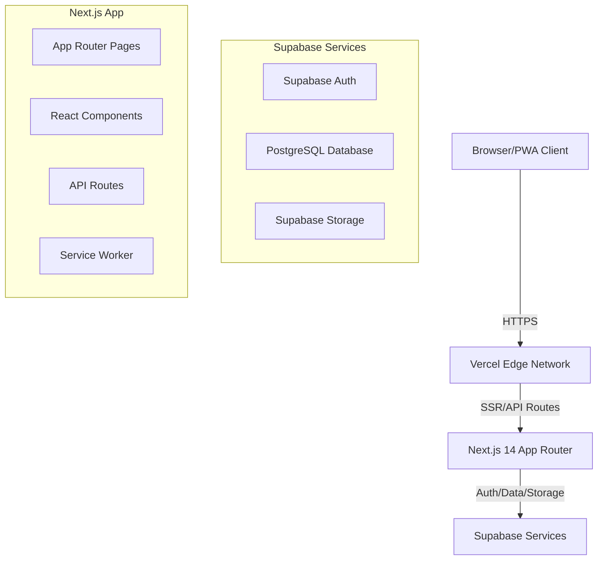

# Design Document

## Overview

Fundfeed is a Progressive Web App built with Next.js 14 (App Router), Supabase, and TypeScript. The architecture follows a modern JAMstack approach with server-side rendering for SEO, client-side interactivity, and Supabase for backend services. The app uses Tailwind CSS for styling with dark mode support, and implements PWA features for installability and offline functionality.

## Architecture

### High-Level Architecture



### Technology Stack

- **Frontend Framework**: Next.js 14 with App Router
- **Language**: TypeScript
- **Styling**: Tailwind CSS with dark mode
- **Authentication**: Supabase Auth (Email/Password, Google OAuth)
- **Database**: Supabase (PostgreSQL)
- **File Storage**: Supabase Storage
- **Deployment**: Vercel
- **PWA**: next-pwa plugin with Workbox
- **Animations**: canvas-confetti library
- **State Management**: React Context + hooks

### Folder Structure

```
fundfeed/
├── app/
│   ├── layout.tsx              # Root layout with providers
│   ├── page.tsx                # Homepage with trending cards
│   ├── launch/
│   │   └── page.tsx            # Launch new round page
│   ├── api/
│   │   └── intro-request/
│   │       └── route.ts        # API route for intro requests
│   └── globals.css             # Global styles
├── components/
│   ├── TrendingCard.tsx        # Fundraising round card
│   ├── LaunchForm.tsx          # Form to create new round
│   ├── AuthButton.tsx          # Sign in/out button
│   ├── ThemeToggle.tsx         # Dark mode toggle
│   ├── FollowButton.tsx        # Follow/unfollow button
│   └── RequestIntroButton.tsx  # Request intro button
├── lib/
│   ├── supabase.ts             # Supabase initialization
│   ├── database.ts             # Database helpers
│   ├── storage.ts              # Storage helpers
│   └── auth.ts                 # Auth helpers
├── contexts/
│   ├── AuthContext.tsx         # Auth state provider
│   └── ThemeContext.tsx        # Theme state provider
├── types/
│   └── index.ts                # TypeScript interfaces
├── public/
│   ├── manifest.json           # PWA manifest
│   ├── icons/                  # App icons
│   └── sw.js                   # Service worker
├── supabase/
│   └── migrations/             # Database migrations
├── next.config.js              # Next.js configuration
├── tailwind.config.js          # Tailwind configuration
└── package.json
```

## Components and Interfaces

### Core Components

#### 1. TrendingCard Component
Displays a fundraising round with logo, name, amount, and follow button.

**Props:**
```typescript
interface TrendingCardProps {
  round: FundraisingRound;
  isFollowing: boolean;
  onFollowToggle: (roundId: string) => Promise<void>;
}
```

#### 2. LaunchForm Component
Form for founders to submit new fundraising rounds.

**Props:**
```typescript
interface LaunchFormProps {
  onSuccess: () => void;
}
```

#### 3. RequestIntroButton Component
Button for investors to request introductions.

**Props:**
```typescript
interface RequestIntroButtonProps {
  roundId: string;
  startupName: string;
  hasRequested: boolean;
}
```

#### 4. AuthButton Component
Handles user authentication UI.

**Props:**
```typescript
interface AuthButtonProps {
  variant?: 'default' | 'compact';
}
```

#### 5. ThemeToggle Component
Toggles between light and dark modes.

**Props:**
```typescript
interface ThemeToggleProps {
  className?: string;
}
```

#### 6. FollowButton Component
Allows users to follow/unfollow startups.

**Props:**
```typescript
interface FollowButtonProps {
  roundId: string;
  isFollowing: boolean;
  onToggle: () => Promise<void>;
}
```

### Context Providers

#### AuthContext
Manages authentication state across the app.

```typescript
interface AuthContextType {
  user: User | null;
  loading: boolean;
  signIn: (email: string, password: string) => Promise<void>;
  signInWithGoogle: () => Promise<void>;
  signOut: () => Promise<void>;
}
```

#### ThemeContext
Manages theme state (light/dark mode).

```typescript
interface ThemeContextType {
  theme: 'light' | 'dark';
  toggleTheme: () => void;
}
```

## Data Models

### Database Tables

#### fundraising_rounds Table

```typescript
interface FundraisingRound {
  id: string;
  companyName: string;
  logoUrl: string;
  raisingAmount: number;
  currency: string;
  description: string;
  deckUrl: string;
  founderId: string;
  createdAt: string;
  updatedAt: string;
  followerCount: number;
  introRequestCount: number;
}
```

**Indexes:**
- `created_at` (descending) - for trending algorithm
- `follower_count` (descending) - for popularity sorting

#### users Table

```typescript
interface User {
  id: string;
  email: string;
  displayName: string;
  photoUrl?: string;
  role: 'founder' | 'investor' | 'both';
  createdAt: string;
  followedRounds: string[];  // Array of round IDs
}
```

#### intro_requests Table

```typescript
interface IntroRequest {
  id: string;
  investorId: string;
  roundId: string;
  startupName: string;
  status: 'pending' | 'accepted' | 'declined';
  createdAt: string;
  message?: string;
}
```

**Indexes:**
- Composite: `investor_id` + `round_id` - for checking existing requests
- `round_id` (ascending) - for fetching requests per round

### Supabase Storage Structure

```
/logos/{roundId}/{filename}
/decks/{roundId}/{filename}
```

## Correctness Properties

*A property is a characteristic or behavior that should hold true across all valid executions of a system—essentially, a formal statement about what the system should do. Properties serve as the bridge between human-readable specifications and machine-verifiable correctness guarantees.*

### Property 1: Trending cards display completeness
*For any* fundraising round displayed on the homepage, the trending card must contain all required fields: logo URL, company name, raising amount, and a follow button.
**Validates: Requirements 1.2**

### Property 2: File upload validation
*For any* file upload attempt, the system must validate both file type and size: logos must be PNG/JPG/WEBP under 5MB, and decks must be PDF under 10MB, rejecting all invalid files before upload to Supabase Storage.
**Validates: Requirements 2.3, 2.4**

### Property 3: Authentication requirement for protected actions
*For any* protected action (follow, request intro, launch round), unauthenticated users must be prompted to sign in before the action executes.
**Validates: Requirements 3.2, 4.5, 10.1**

### Property 4: Intro request idempotency
*For any* investor and fundraising round combination, submitting multiple intro requests must result in only one stored request in the database, with subsequent attempts showing "Intro Requested" status.
**Validates: Requirements 3.5**

### Property 5: Follow state consistency
*For any* user and fundraising round, the follow button state (Follow/Following) must accurately reflect whether the round ID exists in the user's followedRounds array in the database.
**Validates: Requirements 10.2, 10.3, 10.4, 10.5**

### Property 6: Theme persistence and restoration
*For any* theme selection (light or dark), the system must persist the choice to localStorage and restore it on subsequent visits, with initial detection falling back to system preference.
**Validates: Requirements 6.1, 6.3, 6.4**

### Property 7: PWA manifest and service worker registration
*For any* compatible browser visiting Fundfeed, the PWA manifest must contain all required fields and the service worker must successfully register to enable installation prompts.
**Validates: Requirements 5.1, 5.2**

### Property 8: Confetti animation behavior
*For any* successful fundraising round submission, a confetti animation must trigger immediately, run without blocking user interaction, and automatically clean up after 3 seconds.
**Validates: Requirements 7.1, 7.3, 7.4**

### Property 9: Session persistence across refreshes
*For any* authenticated user, refreshing the page must maintain the session without requiring re-authentication until explicit sign-out.
**Validates: Requirements 4.3**

### Property 10: Form validation completeness
*For any* launch form submission, the system must validate that all required fields (company name, logo, raising amount, PDF deck) are present before allowing submission.
**Validates: Requirements 2.2**

### Property 11: Intro request data completeness
*For any* stored intro request in the database, the document must contain investor ID, round ID, startup name, status, and timestamp fields.
**Validates: Requirements 3.3**

### Property 12: Trending algorithm sorting
*For any* set of fundraising rounds, the homepage must display them sorted by the trending algorithm (recency and engagement) in descending order.
**Validates: Requirements 1.3**

## Error Handling

### Client-Side Error Handling

1. **Form Validation Errors**
   - Display inline error messages for invalid inputs
   - Prevent form submission until all validations pass
   - Show clear error messages for file size/type violations

2. **Authentication Errors**
   - Handle Supabase Auth errors (wrong password, user not found, etc.)
   - Display user-friendly error messages
   - Provide retry mechanisms

3. **Network Errors**
   - Show toast notifications for failed API calls
   - Implement retry logic for transient failures
   - Display offline indicator when network is unavailable

4. **File Upload Errors**
   - Handle storage quota exceeded errors
   - Show progress indicators during uploads
   - Allow cancellation of in-progress uploads

### Server-Side Error Handling

1. **API Route Errors**
   - Return appropriate HTTP status codes
   - Log errors to console for debugging
   - Sanitize error messages before sending to client

2. **Supabase Errors**
   - Handle database permission denied errors
   - Catch and handle storage errors
   - Implement exponential backoff for rate limits

### Error Boundaries

Implement React Error Boundaries to catch rendering errors and display fallback UI.

## Testing Strategy

### Unit Testing

**Framework**: Jest + React Testing Library

**Unit Test Coverage:**

1. **Component Tests**
   - TrendingCard renders with correct data
   - LaunchForm validates inputs correctly
   - AuthButton shows correct state based on auth status
   - ThemeToggle switches themes
   - FollowButton displays correct state

2. **Utility Function Tests**
   - Supabase initialization
   - File size validation
   - File type validation
   - Date formatting helpers

3. **Context Tests**
   - AuthContext provides correct user state
   - ThemeContext persists theme to localStorage

### Property-Based Testing

**Framework**: fast-check (JavaScript property-based testing library)

**Property Test Coverage:**

1. **Property 1: Trending cards display completeness**
   - Generate random fundraising rounds
   - Verify all required fields are present in rendered output
   - **Validates: Requirements 1.2**

2. **Property 2: File upload validation**
   - Generate files of various types and sizes
   - Verify rejection of invalid file types and oversized files before upload
   - **Validates: Requirements 2.3, 2.4**

3. **Property 3: Authentication requirement for protected actions**
   - Generate random user states (authenticated/unauthenticated)
   - Test various protected actions (follow, request intro, launch)
   - Verify auth prompt appears for unauthenticated users
   - **Validates: Requirements 3.2, 4.5, 10.1**

4. **Property 4: Intro request idempotency**
   - Generate multiple intro requests for same investor/round pair
   - Verify only one request is stored in the database
   - **Validates: Requirements 3.5**

5. **Property 5: Follow state consistency**
   - Generate random followedRounds arrays and round IDs
   - Verify button state matches whether round ID exists in array
   - Test follow/unfollow operations update state correctly
   - **Validates: Requirements 10.2, 10.3, 10.4, 10.5**

6. **Property 6: Theme persistence and restoration**
   - Generate random theme selections
   - Verify localStorage correctly stores and retrieves theme
   - Test system preference detection on first visit
   - **Validates: Requirements 6.1, 6.3, 6.4**

7. **Property 7: PWA manifest and service worker registration**
   - Verify manifest.json contains all required fields (name, icons, start_url, display)
   - Verify service worker registration succeeds
   - **Validates: Requirements 5.1, 5.2**

8. **Property 8: Confetti animation behavior**
   - Simulate successful form submissions
   - Verify confetti animation triggers immediately
   - Verify UI remains interactive during animation
   - Verify cleanup occurs within 3 seconds
   - **Validates: Requirements 7.1, 7.3, 7.4**

9. **Property 9: Session persistence across refreshes**
   - Generate authenticated sessions
   - Simulate page refreshes
   - Verify session persists without re-authentication
   - **Validates: Requirements 4.3**

10. **Property 10: Form validation completeness**
    - Generate form submissions with various missing fields
    - Verify all required fields are validated before submission
    - **Validates: Requirements 2.2**

11. **Property 11: Intro request data completeness**
    - Generate intro requests with random data
    - Verify stored database records contain all required fields
    - **Validates: Requirements 3.3**

12. **Property 12: Trending algorithm sorting**
    - Generate random sets of fundraising rounds with different timestamps and engagement
    - Verify homepage displays them in correct trending order
    - **Validates: Requirements 1.3**

### Integration Testing

**Framework**: Playwright

**Integration Test Scenarios:**

1. End-to-end user flow: Sign in → View homepage → Follow startup
2. End-to-end founder flow: Sign in → Launch round → See confetti
3. End-to-end investor flow: Sign in → Request intro → See confirmation
4. PWA installation flow on mobile and desktop
5. Theme toggle persistence across navigation
6. Offline functionality with service worker

### Testing Configuration

- Run property-based tests with minimum 100 iterations
- Each property test must include a comment referencing the design document property
- Format: `// Feature: fundfeed-pwa, Property 1: Trending cards display completeness`
- Mock Supabase services in unit tests
- Use test fixtures for consistent test data

## PWA Implementation

### Manifest Configuration

```json
{
  "name": "Fundfeed",
  "short_name": "Fundfeed",
  "description": "Product Hunt for startup fundraising",
  "start_url": "/",
  "display": "standalone",
  "background_color": "#ffffff",
  "theme_color": "#000000",
  "icons": [
    {
      "src": "/icons/icon-192x192.png",
      "sizes": "192x192",
      "type": "image/png"
    },
    {
      "src": "/icons/icon-512x512.png",
      "sizes": "512x512",
      "type": "image/png"
    }
  ]
}
```

### Service Worker Strategy

- **Caching Strategy**: Network-first for API calls, cache-first for static assets
- **Offline Fallback**: Display cached homepage when offline
- **Update Notification**: Prompt user when new version is available
- **Background Sync**: Queue intro requests when offline, sync when online

### Installation Prompt

- Detect PWA install capability
- Show custom install prompt after user engagement
- Track installation analytics

## Dark Mode Implementation

### Tailwind Dark Mode Configuration

```javascript
// tailwind.config.js
module.exports = {
  darkMode: 'class',
  theme: {
    extend: {
      colors: {
        dark: {
          bg: '#0a0a0a',
          card: '#1a1a1a',
          border: '#2a2a2a',
        }
      }
    }
  }
}
```

### Theme Detection and Persistence

1. Check localStorage for saved preference
2. Fall back to system preference (`prefers-color-scheme`)
3. Apply theme class to root HTML element
4. Persist changes to localStorage

## Confetti Implementation

### Library: canvas-confetti

```typescript
import confetti from 'canvas-confetti';

const triggerConfetti = () => {
  confetti({
    particleCount: 100,
    spread: 70,
    origin: { y: 0.6 }
  });
  
  setTimeout(() => {
    confetti.reset();
  }, 3000);
};
```

### Trigger Points

- After successful fundraising round submission
- Non-blocking: runs asynchronously
- Auto-cleanup after 3 seconds

## Supabase Configuration

### Environment Variables

```
NEXT_PUBLIC_SUPABASE_URL=
NEXT_PUBLIC_SUPABASE_ANON_KEY=
```

### Row Level Security (RLS) Policies

#### fundraising_rounds Table

```sql
-- Allow anyone to read
CREATE POLICY "Anyone can read fundraising rounds" ON fundraising_rounds
  FOR SELECT USING (true);

-- Allow authenticated users to create
CREATE POLICY "Authenticated users can create rounds" ON fundraising_rounds
  FOR INSERT WITH CHECK (auth.uid() IS NOT NULL);

-- Allow founders to update/delete their own rounds
CREATE POLICY "Founders can update their rounds" ON fundraising_rounds
  FOR UPDATE USING (auth.uid() = founder_id);

CREATE POLICY "Founders can delete their rounds" ON fundraising_rounds
  FOR DELETE USING (auth.uid() = founder_id);
```

#### users Table

```sql
-- Allow anyone to read
CREATE POLICY "Anyone can read users" ON users
  FOR SELECT USING (true);

-- Allow users to manage their own profile
CREATE POLICY "Users can manage their profile" ON users
  FOR ALL USING (auth.uid() = id);
```

#### intro_requests Table

```sql
-- Allow users to read their own requests
CREATE POLICY "Users can read their requests" ON intro_requests
  FOR SELECT USING (auth.uid() = investor_id);

-- Allow authenticated users to create requests
CREATE POLICY "Authenticated users can create requests" ON intro_requests
  FOR INSERT WITH CHECK (auth.uid() IS NOT NULL);
```

### Storage Policies

```sql
-- Logos bucket: public read, authenticated write
CREATE POLICY "Public logo access" ON storage.objects
  FOR SELECT USING (bucket_id = 'fundraising' AND (storage.foldername(name))[1] = 'logos');

CREATE POLICY "Authenticated logo upload" ON storage.objects
  FOR INSERT WITH CHECK (
    bucket_id = 'fundraising' 
    AND auth.uid() IS NOT NULL
    AND (storage.foldername(name))[1] = 'logos'
  );

-- Decks bucket: authenticated read/write
CREATE POLICY "Authenticated deck access" ON storage.objects
  FOR SELECT USING (
    bucket_id = 'fundraising' 
    AND auth.uid() IS NOT NULL
    AND (storage.foldername(name))[1] = 'decks'
  );

CREATE POLICY "Authenticated deck upload" ON storage.objects
  FOR INSERT WITH CHECK (
    bucket_id = 'fundraising' 
    AND auth.uid() IS NOT NULL
    AND (storage.foldername(name))[1] = 'decks'
  );
```

## Performance Optimization

### Next.js Optimizations

1. **Image Optimization**: Use `next/image` for automatic optimization
2. **Code Splitting**: Automatic with App Router
3. **Server Components**: Use RSC for non-interactive components
4. **Dynamic Imports**: Lazy load heavy components (confetti, auth modals)
5. **Font Optimization**: Use `next/font` for optimal font loading

### Supabase Optimizations

1. **Database Queries**: Use indexes for efficient queries
2. **Pagination**: Implement cursor-based pagination for trending cards
3. **Real-time Listeners**: Use sparingly, prefer one-time reads
4. **Storage**: Compress images before upload
5. **Caching**: Cache database queries with SWR or React Query

### Lighthouse Targets

- Performance: > 90
- Accessibility: > 95
- Best Practices: > 95
- SEO: > 90
- PWA: 100

## Deployment Configuration

### Vercel Configuration

```json
{
  "buildCommand": "next build",
  "outputDirectory": ".next",
  "framework": "nextjs",
  "env": {
    "NEXT_PUBLIC_SUPABASE_URL": "@supabase-url",
    "NEXT_PUBLIC_SUPABASE_ANON_KEY": "@supabase-anon-key"
  }
}
```

### Deployment Checklist

1. Set up Supabase project
2. Configure database tables and RLS policies
3. Set up Storage buckets
4. Create Vercel project
5. Add environment variables
6. Connect GitHub repository
7. Enable automatic deployments
8. Configure custom domain (optional)
9. Test PWA installation on production

## Accessibility

### WCAG 2.1 AA Compliance

1. **Keyboard Navigation**: All interactive elements accessible via keyboard
2. **Screen Reader Support**: Proper ARIA labels and semantic HTML
3. **Color Contrast**: Minimum 4.5:1 ratio for text
4. **Focus Indicators**: Visible focus states for all interactive elements
5. **Alt Text**: Descriptive alt text for all images
6. **Form Labels**: Proper labels for all form inputs

### Accessibility Testing

- Use axe DevTools for automated testing
- Manual keyboard navigation testing
- Screen reader testing (NVDA/JAWS)
